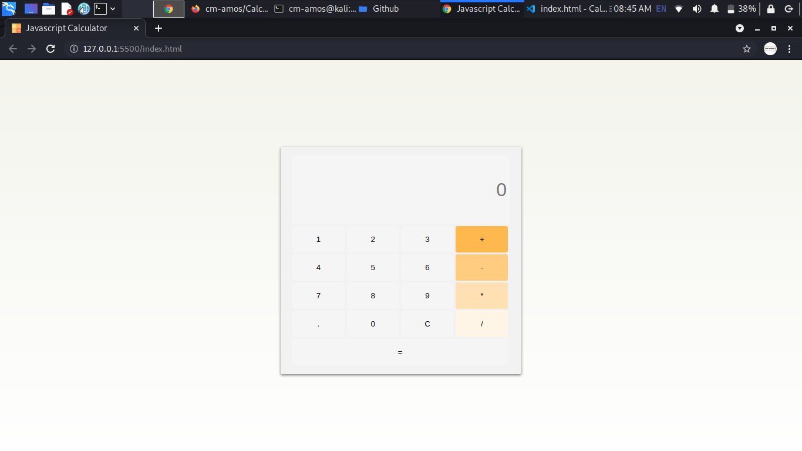

<h1>Javascript Calculator</h1>

 
<u>How to use</u>
<ul>
  <li>Run this commmand in your terminal <pre>git clone git@github.com:cm-amos/Calculator.git</pre> </li>
  <li>cd to that directory like <pre>cd calculator</pre><li>
  <li>open the index.html file in your favorite browser like <pre>open index.html</pre><li>
</ul>
