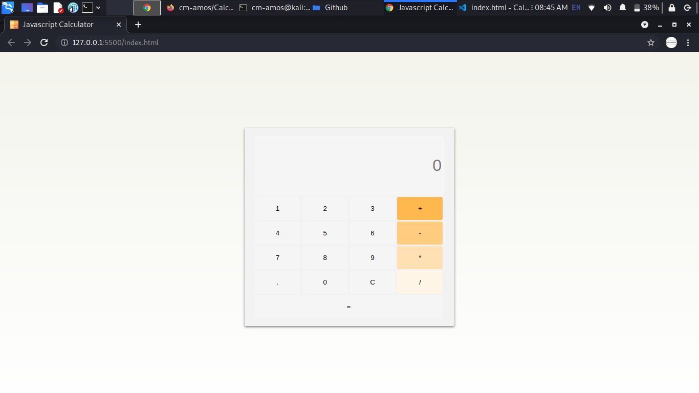

<h1>Calculator</h1>
 

 
<strong>How to use</strong>

1. Run this commmand in your terminal <pre>git clone git@github.com:cm-amos/Calculator.git</pre>  
2. cd to that directory like <pre>cd calculator</pre> 
3. open the index.html file in your favorite browser like <pre>open index.html</pre>

